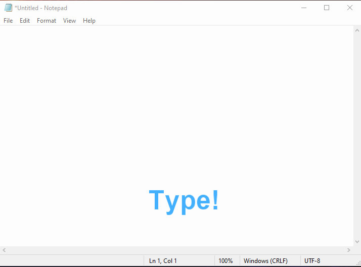
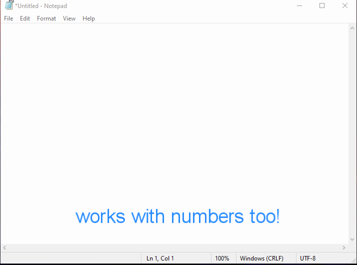

# Auto-Case

## What It Does❓
- Ever typed something in wrong case (UPPER/LOWER), **yes!**
- So,all you can do is press backspace all the way and again retype your words
- Do no more, **Auto-Case** does the work for you all one  key  press away.
- **Auto-Case** is a script wriiten in **C++** that converts your mistake into perfection.
- Or in simple terms it converts **LowerCase ↔ UpperCase**
- With the help of native **Windows** methods and of course the G.O.A.T **C++** anything is possible

## Built On 🛠
### C++
- **Auto-Case** works heavily with clipboard methods, most of the times there is no cross-platform way of doing this as diffrent OS provide diffrent way of interacting with its system components i.e (Clipboard component in here)
- **C++** works best for this kind of project , having target platform as **Windows** which provides **Win32** wrapper for **C++** making interaction with clipboard,   keyboard, windowState all easy to connect with **C++**

## How It Works🤔

### Step-1
- Copy the text you want to change case
### Step-2
- Press ```RCTRL KEY``` ,and there you go its done. 



## How To Contribute🤝 
- Yes,it is open source you can clone and change code to your need.
- Most of the code is self explanatory, anyhow
- for any clarification on code or want to contribute contact 
- [Gmail] / [Twitter] /[LinkedIn]

[Gmail]: <mailto:vashish888@gmail.com>
[LinkedIn]: <https://www.linkedin.com/in/asish-raju-7a0b90192>
[Twitter]: <https://twitter.com/vashish888>